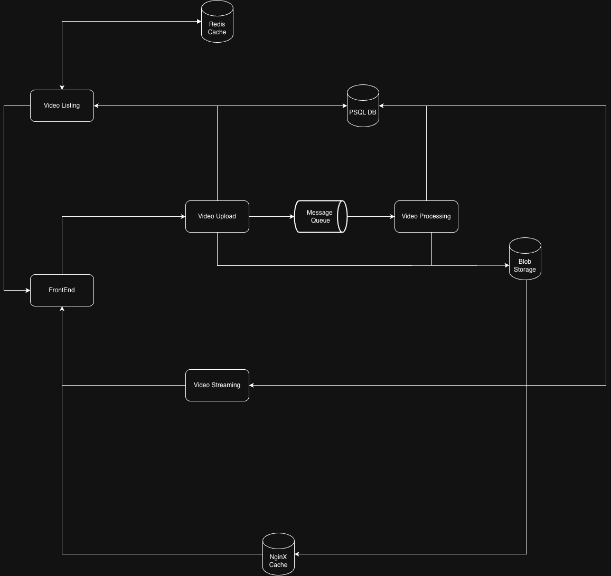
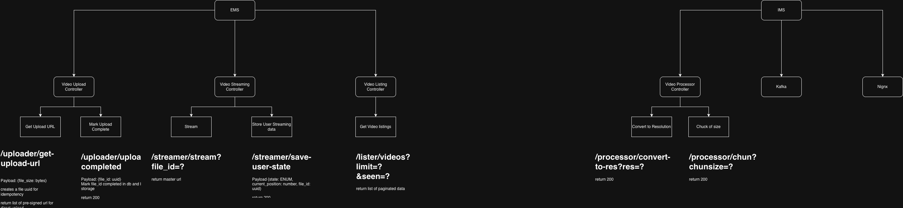

# Video Streaming Service

VOD platform: upload a video, process it into multiple qualities, list it, then play it from a single master playlist.

**License:** [MIT](LICENSE) · Copyright (c) 2026 Mohammed Aman Khan

Diagrams: [HLD](diagrams/HLD.png) · [LLD](diagrams/LLD.png)  
Local runbook: [docs/local-setup.md](docs/local-setup.md)  
**Code wiki (agent/human map):** [docs/wiki/INDEX.md](docs/wiki/INDEX.md)  
Commit messages: [commitlint](https://commitlint.js.org/) — [docs/commitlint.md](docs/commitlint.md)

---

## Implementation status

| Piece | Status |
|---|---|
| Docker data plane (LocalStack S3, Postgres, Redis, Kafka, nginx CDN + UIs) | **Done** |
| Unified EMS HTTP server (`ems` on `:8080`) | **Done** |
| Upload controller (presign → PUT S3 → complete → Kafka) | **Done** |
| Streaming (`GET /streamer/stream`) | **Done** |
| Listing controller | **Stub** (`501`) |
| IMS processor (Kafka → FFmpeg HLS → ready) | **Done** |
| Frontend | **Uploader UI** (listing/player later) |

Primary local entrypoint: **`npm run dev`** (EMS + IMS + Vite) or **`cargo run -p ems-server --bin ems`**.

---

## What this system does

1. A client asks the backend for **presigned upload URLs** and PUTs the file **directly to object storage**.
2. The client calls **upload completed**. The backend checks the object exists, marks the row `uploaded`, and publishes Kafka `video.uploaded`.
3. The **IMS processor** consumes the event, claims the row, runs **FFmpeg ABR HLS** (360p / 720p / 1080p), uploads `hls/{file_id}/`, and sets status `ready` with `playback_path`.
4. Listing will read **Redis**, then **Postgres**, and return paginated catalog data (stub today).
5. Playback: `GET /streamer/stream?file_id=` returns a **master playlist URL**; the player talks to **nginx** (local CDN). nginx pulls from **LocalStack S3** on cache miss.

This is **Video On Demand**. Live ingest is out of scope for the current APIs.

---

## Quick start

```bash
# 1) Infra
docker compose -f docker/docker-compose.yml up -d

# 2) Env + shell with AWS profile / DATABASE_URL / …
cp docs/local-setup/.env.template .env
./docs/local-setup/export.sh

# 3) EMS + uploader UI
npm run dev
# → API http://localhost:8080 · UI http://localhost:5173
```

```bash
curl -s localhost:8080/health
curl -s -X POST localhost:8080/uploader/videos \
  -H 'content-type: application/json' \
  -d '{"file_size":1024,"content_type":"video/mp4"}'
```

Details, ports, and UIs: [docs/local-setup.md](docs/local-setup.md). Uploader app: [docs/wiki/frontend.md](docs/wiki/frontend.md). Dev script: `scripts/dev.sh` (`npm run dev`).

---

## High-level design



### Services

| Service | Role | Code |
|---|---|---|
| **EMS server** | Single domain for upload + listing + streaming | `backend/ems/server` → bin `ems` |
| **Video Upload** | Presigned URLs, complete, enqueue | `backend/ems/upload` (lib + bin `ems-upload`) |
| **Video Listing** | Paginated catalog | `backend/ems/listing` (stub) |
| **Video Streaming** | Master playlist URL | `backend/ems/streaming` |
| **Video Processing (IMS)** | Kafka → FFmpeg HLS → ready | `backend/ims/processor` |
| **Frontend** | Upload desk (React) | `frontend/` |

### Data stores

| Store | Role |
|---|---|
| **Postgres** | Source of truth for video metadata |
| **Redis** | Upload sessions (TTL); later hot listing cache |
| **LocalStack S3** | Raw upload + (later) HLS objects |
| **Kafka** | `video.uploaded` after successful complete |
| **nginx** | Local CDN cache in front of S3 (`:8081`) |

### Request paths

```
Upload (implemented)
  Client → EMS /uploader/* → LocalStack S3 (client PUT)
                          → Postgres (pending / uploaded)
                          → Redis (upload session)
                          → Kafka video.uploaded

Process (planned)
  Kafka → IMS worker → S3 HLS → Postgres ready

List / Play (planned)
  Client → EMS /lister/*  → Redis → Postgres
  Client → EMS /streamer/* → { master_url }
  Player → nginx → LocalStack S3
```

---

## Low-level design



### EMS HTTP surface (unified `:8080`)

| Method | Path | Status |
|---|---|---|
| `GET` | `/health` | Live |
| `GET` | `/ready` | Live (Postgres + Redis + S3) |
| `POST` | `/uploader/videos` | Live — create upload (**201**) |
| `POST` | `/uploader/videos/{file_id}/complete` | Live |
| `POST` | `/uploader/videos/{file_id}/abort` | Live |
| `DELETE` | `/uploader/videos/{file_id}` | Live (soft delete) |
| `GET` | `/lister/videos?limit=&seen=` | Stub `501` |
| `GET` | `/streamer/stream?file_id=` | Stub `501` |
| `POST` | `/streamer/save-user-state` | Stub `501` |

Standalone bins (optional): `ems-upload` `:8085`, `ems-listing` `:8086`, `ems-streaming` `:8087`, `ims-processor` `:8088`.

### Upload (implemented)

**`POST /uploader/videos`** → `201 Created` + `Location: /uploader/videos/{file_id}`

```json
{ "file_size": 104857600, "title": "optional", "content_type": "video/mp4" }
```

Creates `file_id`, a `pending` Postgres row, a Redis session, and returns presigned URL(s). Uses **multipart** when `file_size` exceeds `UPLOAD_PART_SIZE_BYTES` (default 16 MiB).

**`POST /uploader/videos/{file_id}/complete`**

`HeadObject` (and multipart complete when needed). If the object exists: status `uploaded`, publish Kafka `video.uploaded`. Idempotent if already past `pending`.

**`POST /uploader/videos/{file_id}/abort`** — cancel a `pending` upload (multipart abort + `failed`).

**`DELETE /uploader/videos/{file_id}`** — soft delete (`deleted_at`); S3 objects retained.
### Backend layout (hexagonal)

```
backend/
  shared/           # VideoId, VideoStatus, VideoUploaded, logging::init
  ems/server/       # composition root — merge routers, /health /ready
  ems/upload/
    api/            # DTOs, routes, errors
    app/            # GetUploadUrl, CompleteUpload
    domain/         # Video, UploadSession
    ports/          # VideoRepository, ObjectStore, SessionStore, EventPublisher
    adapters/       # postgres, redis, s3/, kafka
    migrations/     # videos table + hot-path indexes
  ems/listing/      # stub router
  ems/streaming/    # stub router
  ims/processor/    # stub worker
```

Upload wiring: handlers → use cases → **ports**; IO only in **adapters**. Migrations run on EMS/upload startup via sqlx.

### Status flow

```
pending → uploaded → processing → ready
                              ↘ failed
```

Listing should only treat `ready` as playable (when implemented).

---

## LocalStack (local AWS)

| Setting | Local value |
|---|---|
| Endpoint | `http://localhost:4566` |
| Region | `us-east-1` |
| Credentials | `test` / `test` |
| Bucket | `videos` |
| Addressing | Path-style |

```
s3://videos/raw/{file_id}/source
s3://videos/hls/{file_id}/master.m3u8
s3://videos/hls/{file_id}/720p/...
```

Presigned URLs use `S3_PUBLIC_ENDPOINT` (usually `http://localhost:4566`) so the browser/curl can PUT. Internal SDK calls use `AWS_ENDPOINT_URL`.

---

## Why these pieces

| Choice | Why |
|---|---|
| Presigned S3 upload (LocalStack) | Large files skip the API; same AWS SDK as prod |
| Kafka after complete | Transcode stays off the HTTP path |
| Unified EMS process | One domain for local/lab; split bins remain for later |
| Redis session + TTL | Stateless upload replicas |
| nginx in front of S3 | Local CDN for `.m3u8` / `.ts` |
| Hexagonal ports/adapters | SOLID, testable, swappable IO |

---

## Out of scope (for now)

- Live streaming
- Auth / API gateway
- Global CDN (nginx is the local stand-in)
- DRM

---

## Repo map

```
backend/           # Rust workspace (default member: ems-server)
docker/            # Compose: LocalStack, Postgres, Redis, Kafka, nginx, UIs
docs/              # local-setup.md + wiki/ + .env helpers
docs/wiki/         # code map — start at INDEX.md
diagrams/          # HLD.png, LLD.png
.cursor/skills/    # code-wiki, file-size-limit, solid, patterns, million-tps
frontend/          # empty
helm/              # empty
scale-test/        # empty
```

Next vertical slice: listing catalog + watch-state + player UI.
